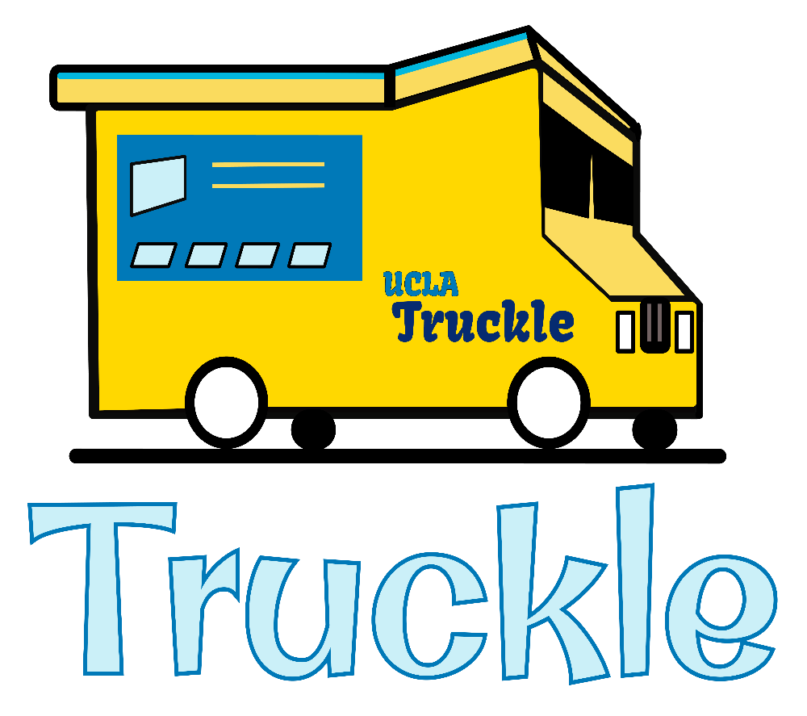

#  Truckle 

## Table of Contents
- [Setup](https://github.com/OscarBeckinger/truckle/#setup)
- [Features](https://github.com/OscarBeckinger/truckle/#features)
- [Authors](https://github.com/OscarBeckinger/truckle/#authors)
- [Images](https://github.com/OscarBeckinger/truckle/#images)

## Setup
1. Please install yarn. If you prefer to install it with npm and you don't have yarn installed already the set up script will ask if you want to install yarn with npm. If prompted to it will do so for you.

2. Run the set up script to set up project (Install dependancies, Initalize API Keys, and Start the Application).
Please run this script from the root directory of the project (truckle).

```bash
./set_up.sh
```

## Features
- **Leader Board:** The Truckle App has a unique leaderboard feature that displays the ranking of the UCLA food trucks. Each truck's score is calculated using their average rating, the number of reviews they have, and the average number of reviews across all trucks. We use a logarithmic function to fairly weight each review.
- **Reviews and Review Managment :** We allow users to post reviews on all food trucks. The reviews consist of a star rating and description. All the reviews of a specific food truck can be viewed on that food truck's page. Users can see and manage their own reviews on the account settings page. Here they can see and delete any old reviews if they please.
- **Favorites :** Users can also favorite food trucks by clicking the star icon on any food truck card. These favorites are persistent and only removed if the user chooses. The user can remove a favorite by clicking the same star icon again that they used to favorite it. The icon appears black if unfavorited and red if favorited. Users can view a list of favorites in their account settings page and also remove any favorites from there.
- **Food Trucks Times and Locations :** Users also have the ability to conveniently view the daily times and locations of the UCLA food trucks on our homepage. This info was scrapped from the UCLA dining website and is presented on our homepage to make Truckle a one stop shop for everything UCLA food truck related.
- **Meaningful Search Through Menu Items :** Are you craving something specific but don't know if a truck has it? Truckle also implements a meaningful search of all food truck menu items. This meaningful search updates as you type and lets you search the title of a menu item and also its description. The search also implements typo tolerance so if you're not too sure how to spell a specific dish don't worry!
- **Fun and Easy to Use Design :** At Truckle we want things to be as easy as possible thats why we tried to implement an interesting, fun, and easy to use design to make the process of exploring and reviewing simple and intuitive.


## Authors
**Truckle** was created by a group of UCLA students   
**Truckle Team:** Oscar Beckinger, Landan Devenecia, Rudaba Sarwar, Rutvi Shah, Joaquin Cruz
<br>
<br>
## Images
<br>
<br>
## Home Page

<br>
<br>
## Settings/Profile Page


